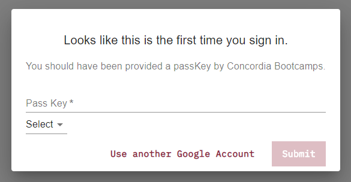

# 6.2.1 Special Topics

---

## It's `_id` and not `id`

---

- A MongoDB _signature_ is the use of the underscore in for the `id`.
- If you don't provide and `_id`, Mongo will generate one for you.

---

It's usually preferable to handle your own `id`s, in my opinion, but that may not always be the case.

---

## Mongo-generated `_id`

If you let Mongo assign its own `_id`, know that it will generate the following:

```js
// in Node
_id: "507f1f77bcf86cd799439011";
```

The 12-byte ObjectId value consists of

- a 4-byte timestamp value, representing the ObjectId’s creation, measured in seconds since the Unix epoch
- a 5-byte random value
- a 3-byte incrementing counter, initialized to a random value

---

### `ObjectId().getTimestamp()`

```js
ObjectId("5e98febee9b6840a209fe251").getTimestamp();

// 2020-04-17T00:56:30.000Z
```

---

## Different User Types

In your projects, you may want to have different user types.

There are many ways of going about this.

---

### Option 1 - Ask on signup

import typeSelect from './assets/user-type-select.gif';


---

### Option 2 - Provide a passKey of some sort

import passkeyExample from './assets/passkey-example.png';



---

### Option 3 - Filter based on email

---

### Option 4 - Provide a url

Provide a `url` with query params that contain a non-recognizable string.

This could become complicated.

1. All users register the same way.
2. An admin could invite a user to become an admin.
3. System generates a `url` with a query string
4. Sends it to user's email.
5. User clicks on it and his/her profile is now flagged as admin.

---

The possibilities are endless.
